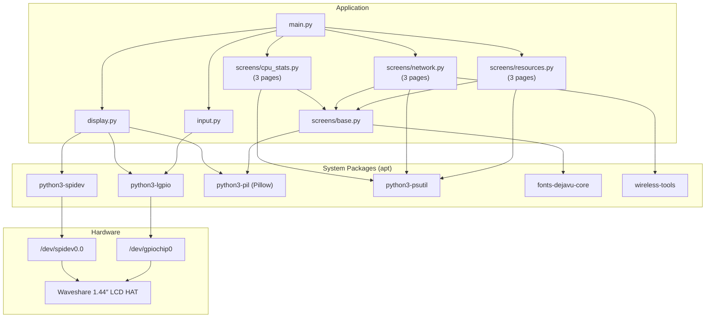
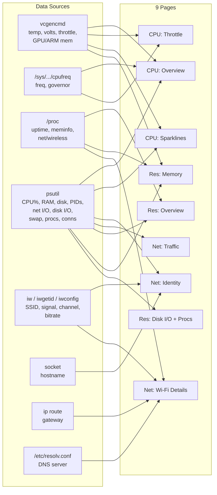
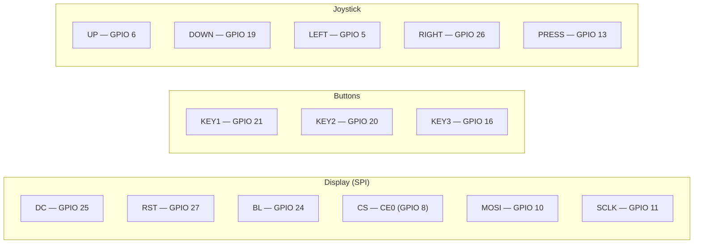

# Pi LCD Stats

System monitor for Raspberry Pi with a [Waveshare 1.44inch LCD HAT](https://www.waveshare.com/wiki/1.44inch_LCD_HAT) (ST7735S, 128x128px, SPI).

Nine pages across three screen categories show CPU stats, network info, and system resources — navigable via the HAT's joystick and buttons. Runs as a systemd service, starts on boot, and gracefully exits if the HAT is not connected.

## Demo (Raspberry Pi Zero W)


## Hardware

| Component | Details |
|-----------|---------|
| **Board** | Any Raspberry Pi with 40-pin GPIO header |
| **Display** | Waveshare 1.44inch LCD HAT (ST7735S, 128x128, SPI) |
| **Interface** | SPI (directly mounted on GPIO header) |
| **Input** | 3 buttons + 5-way joystick (on the HAT) |

Tested on: Raspberry Pi Zero W, Raspbian Trixie, Python 3.13

## Quick Start

```bash
git clone https://github.com/gaiar/pi-lcd-stats.git
cd pi-lcd-stats
./install.sh
# reboot if prompted, then the display starts automatically
```

The installer handles everything: SPI, packages, user groups, venv, systemd service.

## Controls

| Input | Action |
|-------|--------|
| Joystick LEFT / RIGHT | Switch screen category (CPU / Network / Resources) |
| Joystick UP / DOWN | Cycle pages within current screen |
| Joystick PRESS | Toggle backlight on/off |
| KEY1 / KEY2 / KEY3 | Jump to screen 1 / 2 / 3 (resets to page 1) |

## What's on the Screens

Navigation uses a **3 x 3 grid**: LEFT/RIGHT selects the screen, UP/DOWN selects the page. Bottom dots show the current screen, right-edge pips show the current page.

### Screen 1 — CPU Stats (3 pages)

**Page 1 — Overview**

| Metric | Source | Notes |
|--------|--------|-------|
| Temperature | `vcgencmd measure_temp` | Color-coded bar: green <50C, yellow 50-70C, red >70C |
| Voltage | `vcgencmd measure_volts` | Core voltage |
| Frequency | `/sys/devices/system/cpu/cpu0/cpufreq/scaling_cur_freq` | Current CPU clock in MHz |
| CPU Usage | `psutil.cpu_percent()` | Percentage with color-coded bar |

**Page 2 — Throttle Status**

| Metric | Source | Notes |
|--------|--------|-------|
| Current throttle flags | `vcgencmd get_throttled` (bits 0-3) | Under-voltage, freq capped, throttled, soft temp limit |
| Since-boot flags | `vcgencmd get_throttled` (bits 16-19) | Same flags but cumulative since boot |
| CPU Governor | `/sys/devices/system/cpu/cpu0/cpufreq/scaling_governor` | `ondemand`, `performance`, etc. |

**Page 3 — History Graphs**

| Metric | Source | Notes |
|--------|--------|-------|
| Temperature sparkline | `vcgencmd measure_temp` (last 60 samples) | ~2 min history at 2s refresh |
| CPU usage sparkline | `psutil.cpu_percent()` (last 60 samples) | ~2 min history at 2s refresh |

### Screen 2 — Network (3 pages)

**Page 1 — Identity**

| Metric | Source | Notes |
|--------|--------|-------|
| Hostname | `socket.gethostname()` | |
| IP Address | `psutil.net_if_addrs()` | First IPv4 on wlan0 or eth0 |
| Wi-Fi SSID | `/usr/sbin/iwgetid -r` | |
| Signal | `/usr/sbin/iwconfig wlan0` | dBm value |
| MAC Address | `psutil.net_if_addrs()` | wlan0 hardware address |

**Page 2 — Traffic**

| Metric | Source | Notes |
|--------|--------|-------|
| TX rate | `psutil.net_io_counters(pernic=True)` | KB/s, computed from deltas |
| RX rate | `psutil.net_io_counters(pernic=True)` | KB/s, computed from deltas |
| Errors | `psutil.net_io_counters()` | Combined in/out errors (red if > 0) |
| Drops | `psutil.net_io_counters()` | Combined in/out drops (red if > 0) |
| Connections | `psutil.net_connections(kind='inet')` | Open socket count |

**Page 3 — Wi-Fi Details**

| Metric | Source | Notes |
|--------|--------|-------|
| Frequency | `iw dev wlan0 link` | Operating frequency in MHz |
| TX Bitrate | `iw dev wlan0 link` | Negotiated link speed |
| Link Quality | `/proc/net/wireless` | Numeric quality value |
| Gateway | `ip route show default` | Default gateway IP |
| DNS Server | `/etc/resolv.conf` | Primary nameserver |

### Screen 3 — Resources (3 pages)

**Page 1 — Overview**

| Metric | Source | Notes |
|--------|--------|-------|
| CPU Load | `os.getloadavg()` | 1 / 5 / 15 min averages |
| RAM | `psutil.virtual_memory()` | Usage bar + used/total MB |
| SD Card | `psutil.disk_usage('/')` | Usage bar + used/total GB |
| Processes | `psutil.pids()` | Running process count |
| Uptime | `/proc/uptime` | Days, hours, minutes |

**Page 2 — Memory Deep-Dive**

| Metric | Source | Notes |
|--------|--------|-------|
| Swap | `psutil.swap_memory()` | Usage bar + used/total MB (or "disabled") |
| Buffers/Cache | `/proc/meminfo` | Buffers and cached memory in MB |
| Available | `/proc/meminfo` `MemAvailable` | Actual usable memory |
| Dirty Pages | `/proc/meminfo` `Dirty` | Pending disk writes (yellow if > 1MB) |
| GPU Memory | `vcgencmd get_mem gpu` | GPU allocation from config.txt |
| ARM Memory | `vcgencmd get_mem arm` | ARM allocation from config.txt |

**Page 3 — Disk I/O & Top Processes**

| Metric | Source | Notes |
|--------|--------|-------|
| Disk Read rate | `psutil.disk_io_counters()` | KB/s, computed from deltas |
| Disk Write rate | `psutil.disk_io_counters()` | KB/s, computed from deltas |
| IO Wait | `psutil.cpu_times_percent().iowait` | Red if > 10% |
| Top 4 processes | `psutil.process_iter()` | By CPU%, name truncated to 14 chars |

## Architecture

### Project Structure

```
pi-lcd-stats/
├── src/pi_lcd_stats/
│   ├── main.py              # Entry point, main loop, screen/page manager
│   ├── display.py            # ST7735S SPI driver (spidev + lgpio + numpy)
│   ├── input.py              # Button/joystick handler (lgpio)
│   └── screens/
│       ├── base.py           # Base screen class, sparkline, progress bar, History
│       ├── cpu_stats.py      # Screen 1 (3 pages): stats, throttle, sparklines
│       ├── network.py        # Screen 2 (3 pages): identity, traffic, Wi-Fi details
│       └── resources.py      # Screen 3 (3 pages): overview, memory, disk I/O + procs
├── pi-lcd-stats.service      # systemd unit template (__USER__, __PROJECT_DIR__)
├── install.sh                # One-command setup (SPI, apt, venv, systemd)
├── uninstall.sh              # Clean removal
├── pyproject.toml
├── LICENSE
└── .gitignore
```

### Dependency Graph



### Data Sources



### GPIO Pin Map



## Service Management

```bash
# Status
sudo systemctl status pi-lcd-stats

# Stop / start / restart
sudo systemctl stop pi-lcd-stats
sudo systemctl start pi-lcd-stats
sudo systemctl restart pi-lcd-stats

# Follow logs
journalctl -u pi-lcd-stats -f

# Disable auto-start
sudo systemctl disable pi-lcd-stats

# Uninstall completely
./uninstall.sh
```

If the LCD HAT is not connected, the service logs `LCD HAT not detected` and exits cleanly (exit code 0) — it will not restart in a loop.

## Manual Run (without service)

```bash
cd pi-lcd-stats
sudo systemctl stop pi-lcd-stats   # free the display
source .venv/bin/activate
cd src
python -m pi_lcd_stats.main
# Ctrl+C to stop
```

### Demo Mode

Auto-cycles through all 9 pages (4s per page) with placeholder network data — useful for recording videos. Joystick input still works and resets the auto-advance timer.

```bash
python -m pi_lcd_stats.main --demo
```

## Requirements

- Raspberry Pi with 40-pin GPIO header (Zero W, 3B+, 4, 5, etc.)
- Raspbian / Raspberry Pi OS (Bookworm or Trixie) — Debian-based
- Python 3.11+
- SPI enabled
- Waveshare 1.44inch LCD HAT connected to the GPIO header

## License

MIT
